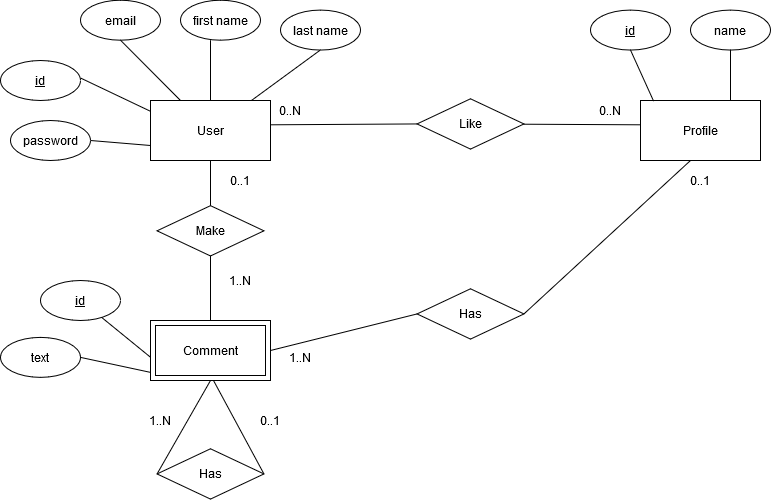

# UCDb-backend-node

## Sobre o desenvolvimento

O projeto foi desenvolvido em Node.js, utilizando Sequelize e Express. Banco de dados em MySQL.

Aplicação disponível em [https://ucdb-backend-node.herokuapp.com/](https://ucdb-backend-node.herokuapp.com/).

#### Modelo Entidade Relacionamento




## Como executar?

Para rodar seu projeto abra um terminal, entre no diretório raiz do projeto e execute o comando abaixo:
```
npm install
```
Em seguida...
```
npm start
```
